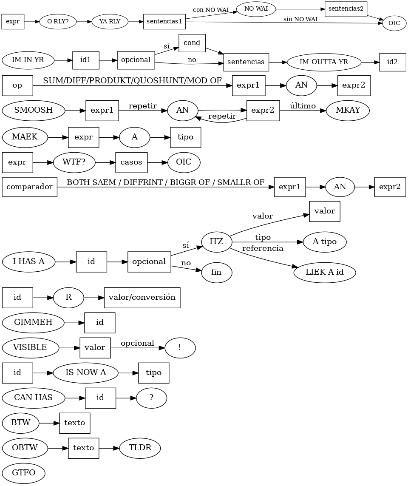

# 🧠 Gramática Sintáctica de LOLCODE

 **gramática  completa** del lenguaje esotérico **LOLCODE**, expresada en notación **GIC, BNF, EBNF y ABNF**, junto con un **diagrama sintáctico visual** que representa todas sus producciones.

---

## 📌 Diagrama Sintáctico Completo

El siguiente diagrama representa todas las estructuras del lenguaje:

---

## 📚 Contenido Representado

Este diagrama incluye:

- ✅ Estructura general del programa (`HAI` ... `KTHXBYE`)
- ✅ Comentarios (`BTW`, `OBTW` ... `TLDR`)
- ✅ Inclusión de librerías (`CAN HAS ... ?`)
- ✅ Declaración y asignación de variables (`I HAS A`, `R`)
- ✅ Entrada y salida (`GIMMEH`, `VISIBLE`)
- ✅ Operaciones aritméticas (`SUM OF`, `PRODUKT OF`, etc.)
- ✅ Comparaciones (`BOTH SAEM`, `DIFFRINT`, etc.)
- ✅ Concatenación (`SMOOSH ... AN ... MKAY`)
- ✅ Conversión de tipos (`MAEK`, `IS NOW A`)
- ✅ Condicionales (`O RLY?`, `YA RLY`, `NO WAI`, `OIC`)
- ✅ Switch-case (`WTF?`, `OMG`, `OMGWTF`)
- ✅ Bucles (`IM IN YR`, `UPPIN`, `TIL`, etc.)
- ✅ Salida de bucles (`GTFO`)

---

---

## 🔖 Licencia

Este material puede ser reutilizado y adaptado libremente con atribución al autor del diagrama y los esquemas.

