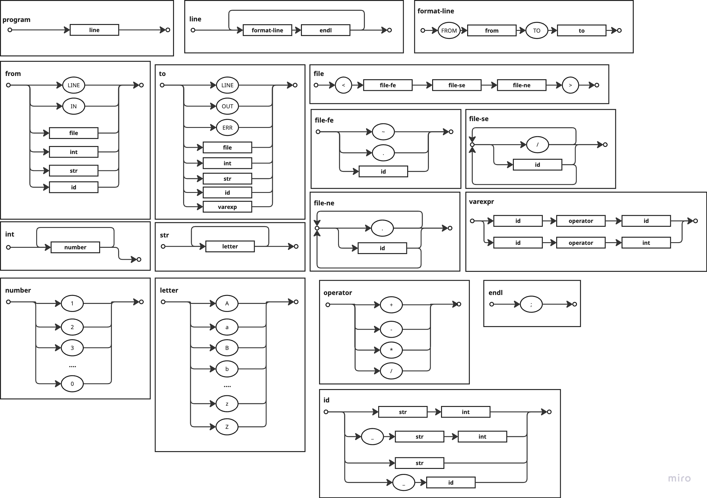
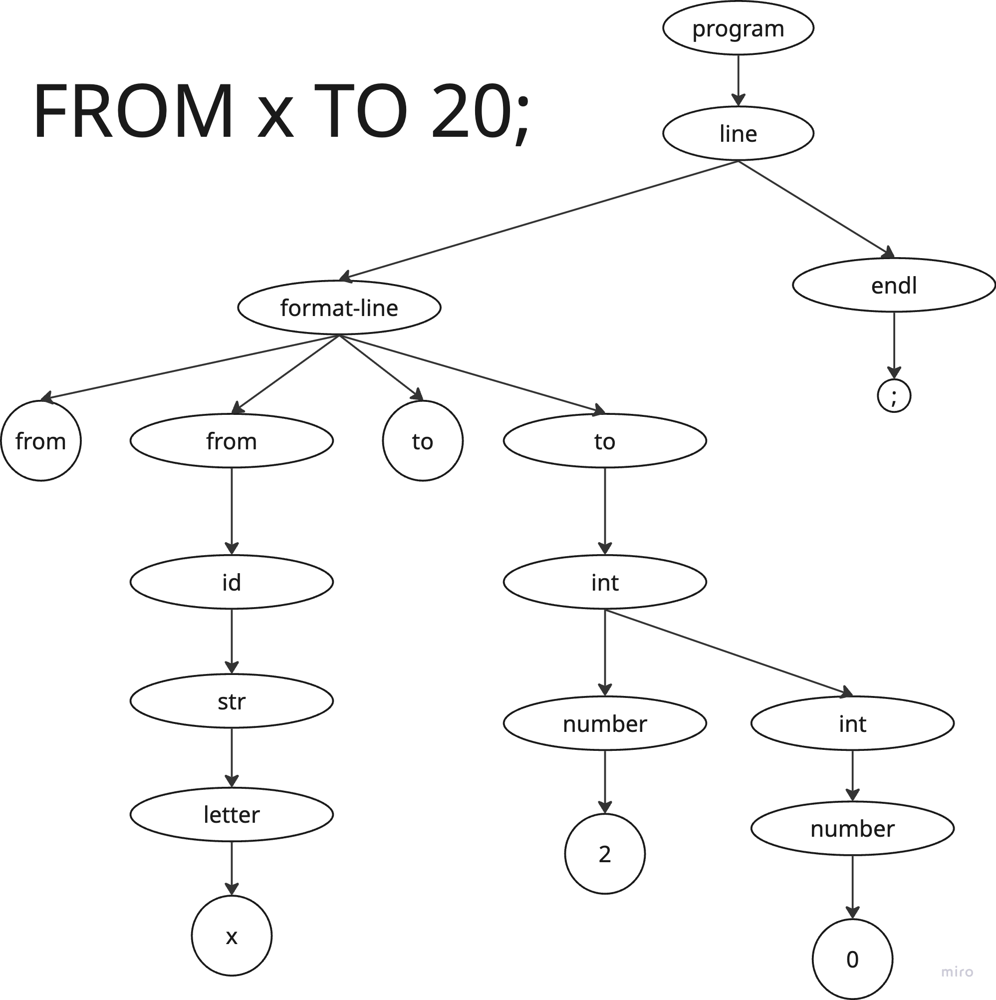

# Gramática Sintáctica de FROM HERE TO THERE

**gramática completa** del lenguaje esotérico **FROM HERE TO THERE**, expresada en notación **GIC, BNF, EBNF y ABNF**, junto con un **diagrama sintáctico visual** que representa todas sus producciones.

---

## 📌 Diagrama Sintáctico Completo

El siguiente diagrama representa todas las estructuras del lenguaje:

### Arbol

---
